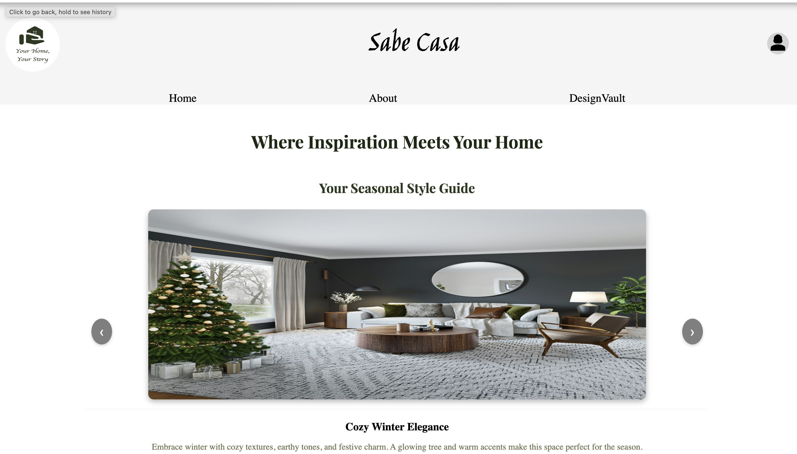
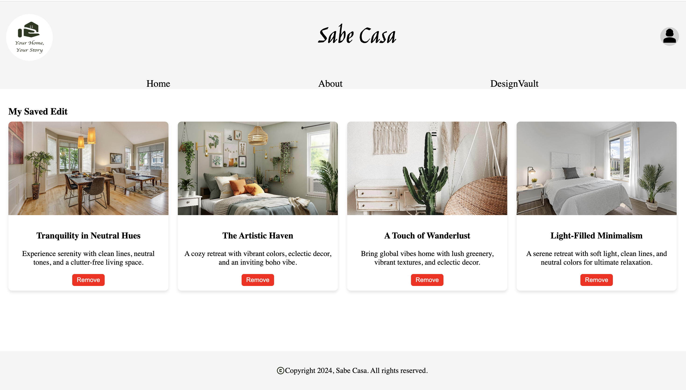

# 🏡 Sabe Casa — Home Decor Application
---

## Table of Contents

- [Introduction](#introduction)
- [Features](#features)
- [Technologies Used](#technologies-used)
- [Architecture](#architecture)
- [UI Components](#ui-components)
- [Setup Instructions](#setup-instructions)
- [Design Philosophy](#design-philosophy)
- [Accessibility](#accessibility)

---

##  Introduction

**Sabe Casa** is a frontend web application built using React. 
It allows users to browse curated room designs across different styles and save their favorites for later. 
The app is intended for anyone looking for home decor ideas, offering a simple and responsive interface without requiring user login or backend services.




---

## Features

-  **My Saved Edit**: Add favorite designs to your personal collection and manage them from the profile dropdown.
-  **Design Gallery**: Scroll through a card-based layout of themed room inspirations.
-  **Editor's Picks**: A selection of highlighted styles curated for visual impact.
-  **Filters**: Quickly filter inspirations by room type: `Living Room`, `Bedroom`, `Kitchen`.
-  **Seasonal Carousel**: Explore featured decor based on the season (e.g., *Summer Vibes*).
-  **Responsive Design**: Optimized layout for desktop and mobile devices.

---

##  Technologies Used

| Technology   | Purpose                         | Notes                            |
|--------------|---------------------------------|----------------------------------|
| React 18     | UI library                      | Functional components + Hooks    |
| Vite         | Build tool                      | Fast HMR, lightweight builds     |
| JavaScript   | Programming language            | Modern syntax and modules        |
| CSS3         | Styling                         | Flexbox/Grid, hover effects      |

---

## Architecture

The project uses a simple, component-based architecture for maintainability and scalability.

---

##  UI Components

| Component       | Description                                                              |
|-----------------|--------------------------------------------------------------------------|
| `Card`          | Displays individual decor inspiration with title, image, and heart icon. |
| `Carousel`      | A horizontal slider showcasing seasonal designs.                         |
| `SavedEdit`     | Lists all designs marked as favorite with a remove option.               |
| `Header`        | Top navigation bar with links and profile dropdown.                      |
| `FilterButtons` | Buttons to filter decor ideas by room type.                              |

---

## Setup Instructions

### Prerequisites

- Node.js (v16 or higher)
- npm (v8 or higher)

### Installation

```bash
git clone https://github.com/shreya-gudsurkar/home-decor.git
cd home-decor
npm install

## Design Philosophy

- **User-Centric Design**: Easy navigation and clear information presentation for an intuitive user experience.
* **Minimalistic Aesthetic**: Simple, clean design focusing on visuals that matter most — the decor items.
* **Performance Optimization**: Fast page load times, optimized images, and smooth transitions.
* **Mobile-First**: A responsive, mobile-first design ensuring a seamless experience on all screen sizes.
* **Component Reusability**: Modular components that simplify code maintenance and UI consistency.

## Accessibility

This project prioritizes accessibility by implementing WCAG 2.1 standards, including:

* **Semantic HTML Structure**: Provides better navigation and screen reader compatibility.
* **Keyboard Navigation**: Full support for navigating UI elements via keyboard.
* **ARIA Attributes**: Assistive labels for interactive components.
* **High Color Contrast**: Ensures visibility and clarity for users with low vision.
* **Alt Text**: Included for all images to improve screen reader interpretation.
* **Focus Management**: Clear focus styles for active elements.

## Future Enhancements

* **AI-Powered Recommendations**: Suggest decor styles based on saved designs or user interactions.
* **User Accounts**: Enable login functionality to persist saved edits and preferences.
* **Product Tagging & Marketplace**: Link decor items to real products and stores.
* **3D Room Viewer**: Interactive space planning tool to visualize furniture layout and design


